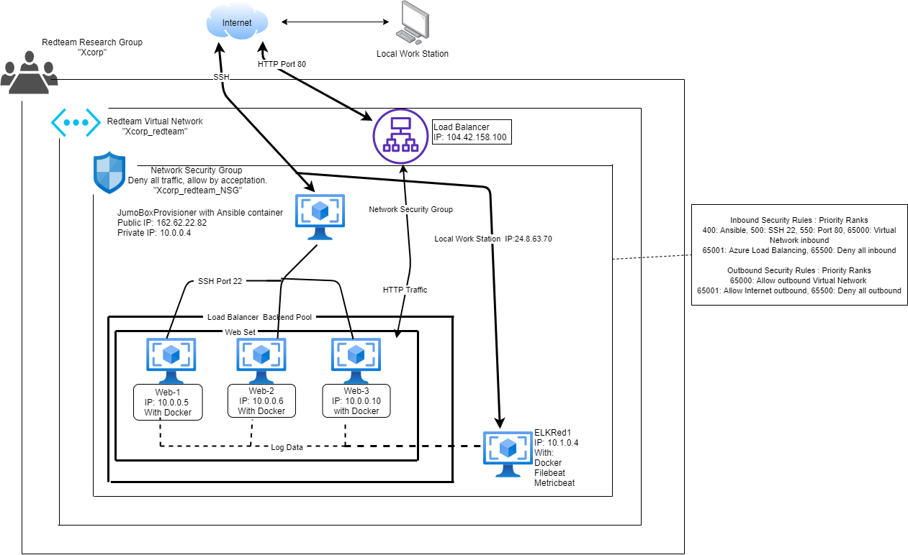

## Automated ELK Stack Deployment

The files in this repository were used to configure the network depicted below.

These files have been tested and used to generate a live ELK deployment on Azure. They can be used to either recreate the entire deployment pictured above. Alternatively, select portions of the playbook1.yml file may be used to install only certain pieces of it, such as docker.io, python3-pip, DVWA.

  - README /playbooks_yaml_for_elk_stack/ansible-docker/playbook1.yml: playbook1.yml

This document contains the following details:
- Description of the Topology
- Access Policies
- ELK Configuration
  - Beats in Use
  - Machines Being Monitored
- How to Use the Ansible Build

### Description of the Topology

The main purpose of this network is to expose a load-balanced and monitored instance of DVWA, the D*mn Vulnerable Web Application.

Load balancing ensures that the application will be highly available, in addition to restricting permissions to the network.
- This is the type of setup for modern websites to provide continous avilability through redudancy.

Integrating an ELK server allows users to easily monitor the vulnerable VMs for changes to the file logging system and system processes.
- Filebeat collects data about the file logging system that are useful to the user.
- Metricbeat collects machine metrics, such as uptime and utilizaton that help determive the valuable sytem analytics.

The configuration details of each machine may be found below.

| Name     | Function      | IP Address | Operating Sysen |
|----------|---------------|------------|-----------------|
| Jump Box | Gateway       | 10.0.0.4   | Linux           |
| Web-1    | Load Balancer | 10.0.0.5   | Linux           |
| Web-2    | Load Balancer | 10.0.0.6   | Linux           |
| Web-3    | Load Balancer | 10.0.0.10  | Linux           |
| ELK Red1 | Elk Stack     | 10.1.0.4   | Linux           |

### Access Policies

The machines on the internal network are not exposed to the public Internet. 

Only the Jumpbox machine can accept connections from the Internet. Access to this machine is only allowed from the following IP addresses:
- Public IP Address 168.62.22.82

Machines within the network can only be accessed by an internal IP
- Access is restricted to users computer through IP Address 24.5.63.70

A summary of the access policies in place can be found in the table below.

| Name     | Public Accessible | Allowed IP Addresses                      |
|----------|-------------------|-------------------------------------------|
| Jump Box | No                | 168.62.22.82, 24.8.63.70                  |
| Web-1    | No                | 10.0.0.4                                  |
| Web-2    | No                | 10.0.0.4                                  |
| Web-3    | No                | 10.0.0.4                                  |
| ELK Red1 | No                | 10.0.0.5, 10.0.0.5, 10.0.0.10, 24.8.63.70 |

### Elk Configuration

Ansible was used to automate configuration of the ELK machine. No configuration was performed manually, which is advantageous because...
- Configuration through automation provides a standard and controlled configuration and detailed information about the install.

The playbook implements the following tasks:
- The playbook begins with a Apt install of docker.io to ELK VM.
- We will then install python3-pip to complete the additional commands in the playbook.
- Increaseing the max Virtual memory to 262144 and utilize the increased memory for desired preformance.
- Lastly, we will install and launch the ELK Container on the virtual machine with specific port access through 5601, 9200 and 5044.

The following screenshot displays the result of running `docker ps` after successfully configuring the ELK instance.

### Target Machines & Beats
This ELK server is configured to monitor the following machines:
- 10.0.0.4, 10.0.0.5 and 10.0.0.10

We have installed the following Beats on these machines:
- Filebeat 
- Metricbeat

These Beats allow us to collect the following information from each machine:
- Filbeat, is a shipper that keeps information simple by delivering and centralizing log file data.
- Metricbeat, is a shipper of metircs that are specific to the systems and services in regards of the CPU to memory usage.

### Using the Playbook
In order to use the playbook, you will need to have an Ansible control node already configured. Assuming you have such a control node provisioned: 

SSH into the control node and follow the steps below:
- Configure ELK VM with doker by adding elkservers to the /etc/ansible/hosts.
- Update the Elk install-elk.yml file to include:
  - Increased virtual memory. (This is nessary for the ELK container to run effeciaently.)
  - Install docker.io
  - install python3-pip (Docker pyhton pip module.)
- Run the playbook install-elk.yml, and navigate to Kibana Landing page local work station to check that the configurations and data streams are working properly.

_TODO: Answer the following questions to fill in the blanks:_
- install-elkc.yml playbook  is copied to Jumpbox docker at the following loaction /etc/ansible.
- The playbooks will refer back to the etc/ansible/ansible.cfg file to specify the correct VM's to configure.
 - Install File beat and Metric beat will be installed on the Web VM's used for load balncing.
  - README /playbooks_yaml_for_elk_stack/filebeat/roles/filebeat-playbook.yml: filebeat-playbook.yml
    - README /playbooks_yaml_for_elk_stack/filebeat/files/filebeat-config.yml: filebeat-config.yml
  - README /playbooks_yaml_for_elk_stack/metricbeat/roles/metricbeat-playbook.yml: metricbeat-playbook.yml
    - README /playbooks_yaml_for_elk_stack/metricbeat/files/metricbeat-config.yml: metricbeat-config.yml

- Once all VMs and playbooks and instatlled you will need to go to the following url to access the Kibana tool. http://[your.ELK-VM.External.IP]:5601/app/kibana

